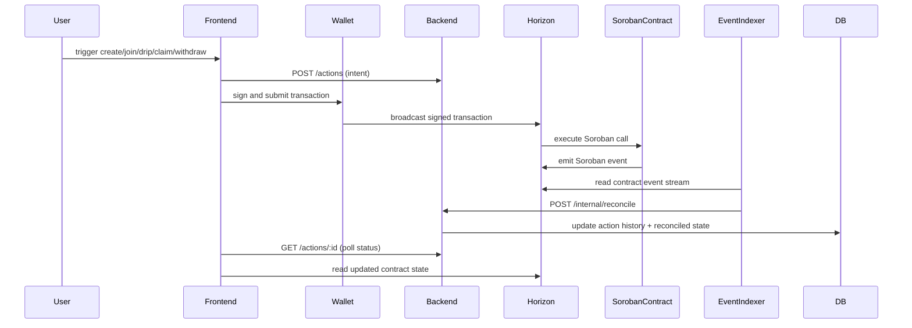

# VaultQuest Architecture

This document maps the VaultQuest stack and shows how the frontend,
wallet, backend, Soroban contracts, Stellar network, and indexer flow
connect to deliver the `create`, `join`, `drip`, `claim`, and `withdraw`
user journeys.

## Architecture overview

VaultQuest separates the stack into three authoritative layers:

- **Soroban contract state** — true source of vault balances, deposits,
  positions, prize eligibility, and claim/withdraw outcomes.
- **Backend / indexed state** — authoritative history of user intents,
  reconciled contract events, subscriptions, payout records, and dashboard
  rollups.
- **Frontend local state** — optimistic transaction state, form input, and
  UI-only caching while the network confirms.

### System diagram

```mermaid
flowchart TD
  subgraph FRONTEND[VaultQuest frontend]
    UI[UI components]
    Wallet[stellar-wallet-connect wallet layer]
  end

  subgraph BACKEND[Backend action ledger]
    API[Fastify API\nPOST /actions\nPATCH /actions/:id/submitted\nGET /actions]
    Reconcile[Internal reconcile\nPOST /internal/reconcile]
    DB[(Postgres ledger)]
  end

  subgraph INDEXER[Event indexer]
    Reader[Contract event poller]\n(Event source)
  end

  subgraph STELLAR[Soroban / Stellar network]
    Horizon[Horizon / RPC endpoint]\n(public or private RPC)
    Contract[DripPool Soroban contract]\n(create/join/drip/claim/withdraw)
  end

  UI -->|intent + query| API
  UI -->|wallet transaction| Wallet
  Wallet -->|sign & broadcast tx| Horizon
  Horizon -->|execute tx| Contract
  Contract -->|emit events| Horizon
  Horizon -->|event stream| Reader
  Reader -->|reconcile payload| Reconcile
  Reconcile -->|write index| DB
  API -->|read/write actions| DB
  UI -->|poll status| API
  UI -->|read contract state| Horizon
```

## User action flow

The following flow applies to the core actions `create`, `join`, `drip`,
`claim`, and `withdraw`.



## Event indexing flow

VaultQuest relies on event-driven reconciliation so that backend intent
records and contract state stay aligned.

1. A signed transaction is submitted by the frontend wallet to Stellar.
2. The Soroban contract executes and emits structured events.
3. The indexer reads those events from Horizon / the Soroban RPC.
4. The indexer posts a reconciled payload to `POST /internal/reconcile`.
5. The backend matches the event to the pending intent record and updates
   the ledger.

This makes the backend service a reliable view of user actions even when the
frontend reconnects, reloads, or polls later.

## Source-of-truth boundaries

### Soroban contract

The contract is authoritative for:

- Vault totals, prize pool size, and yield accounting.
- User deposit and position state.
- Prize draw results, claim eligibility, and withdraw outcomes.
- Contract event emission for every `create`, `join`, `drip`, `claim`, and
  `withdraw` transaction.

### Backend / indexer

The backend is authoritative for:

- Action intent lifecycle tracking (`pending`, `submitted`, `confirmed`).
- Subscription scheduling and drip history.
- User dashboard rollups and activity history.
- Event reconciliation and privacy-safe action records.

### Frontend / wallet

The frontend is authoritative for:

- Optimistic transaction state and pending UX flows.
- Wallet connection state and signed transaction submission.
- Local view state until the backend or contract confirms final results.

## Configuration boundaries

VaultQuest deployments are boundary-driven by configuration:

- Wallet + frontend read from browser-safe Horizon/Soroban environment values
  such as `NEXT_PUBLIC_HORIZON_URL` and `PUBLIC_SOROBAN_NETWORK_PASSPHRASE`.
- The action ledger backend is configured by server-only values such as
  `DATABASE_URL`, `INTERNAL_SERVICE_SECRET`, and `PORT`.
- Contract IDs and network endpoints are injected per deployment, not
  hard-coded in application logic.

## Related docs

- [`docs/STATE_MODEL.md`](./STATE_MODEL.md) — contract, backend, and frontend state
  ownership and data model definitions.
- [`docs/env-inventory.md`](./env-inventory.md) — frontend and backend configuration
  boundaries.
- [`backend/docs/ARCHITECTURE.md`](../backend/docs/ARCHITECTURE.md) — backend service layout
  and reconciliation details.
